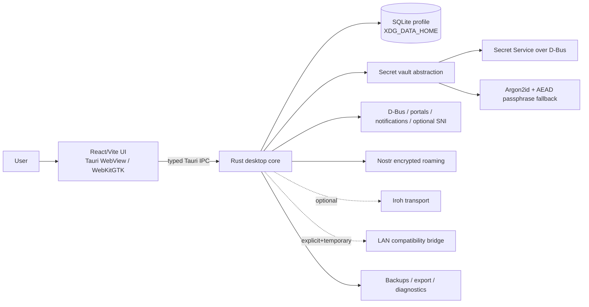
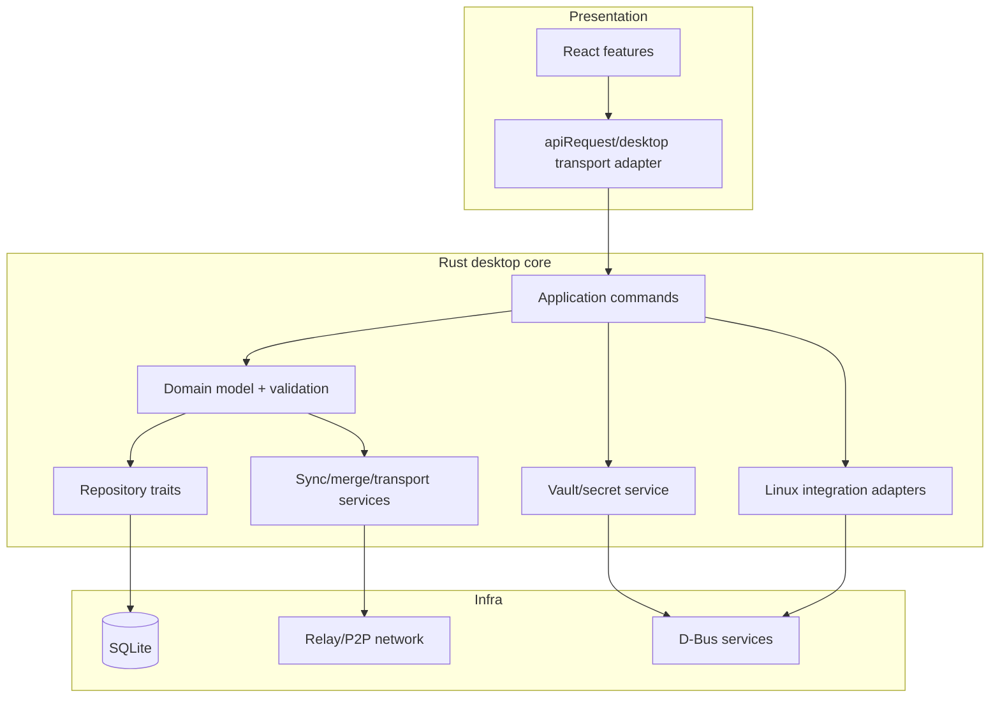

# 00 — Executive architecture: Arch Linux

## Chosen architecture

**[PROPOSAL]** Normal mode is one user-session process tree: Tauri shell + in-process Rust core + WebKitGTK webview. There is no default localhost backend, no default systemd user service, no root helper and no PostgreSQL daemon.

## Why this is least-sufficient on Arch

1. **[FACT]** The current UI is already React/Vite and has a centralized API client.
2. **[FACT]** The backend and `sync-core` already use Rust.
3. **[FACT]** current SQL is PostgreSQL-specific enough that an embedded database is not a DSN change.
4. **[FACT]** Tauri on Linux uses the platform WebKitGTK stack rather than bundling Chromium.
5. **[FACT]** Arch is rolling-release and does not support partial upgrades.
6. **[INFERENCE]** Reusing React while moving application authority into Rust gets the Docker-free footprint benefit without a high-risk UI rewrite.
7. **[INFERENCE]** On Arch, allowing pacman to own system libraries and `/usr` is safer than freezing/bundling an entire desktop stack into the app.
8. **[PROPOSAL]** Native quality comes from correct Linux/XDG/D-Bus/package behavior, not from rewriting the visual layer in GTK/Qt.

## Non-negotiable invariants

- Local edits remain durable without network.
- Stable entity UUIDs, tombstones, capability epochs and deterministic merge semantics survive storage replacement.
- Existing versioned protocols are preserved unless changed through an explicit new protocol version.
- Secret material is never put into localStorage or plaintext configuration/SQLite as a convenience fallback.
- The default process does not listen on TCP/UDP for UI communication.
- D-Bus integrations are optional capabilities; absence of notification/tray/portal/keyring services must degrade explicitly, not crash the planner.
- `/usr` files belong to the package manager; the app does not self-overwrite a pacman-installed binary.
- User data lives in XDG user directories and survives ordinary package removal.
- The app never performs `pacman -Sy`, automatic system downgrades, firewall edits, polkit changes or `loginctl enable-linger`.
- A new desktop database schema is compatible at application/protocol level, not raw-file/SQL level.

## Process/lifecycle profiles

### Default interactive
UI, SQLite, sync coordinator, relay transports and backup scheduler exist only while the application process is running. On close, queued durable operations remain in SQLite; next launch resumes.

### Opt-in tray
If a StatusNotifier host exists and the user enables background/tray behavior, closing the window may leave the user process alive. This is a preference, not an installation invariant.

### Optional headless/user service
**[EXPERIMENT-NEEDED]** A future systemd user service can be justified only if background synchronization provides measurable product value and its interaction with graphical session D-Bus/keyrings is specified. It is not part of v1 GA and must never silently enable linger.

## Application boundaries

The React side asks for application operations such as `create_card`, `move_card`, `export_bundle`; it never receives raw SQL/fs/shell/keyring primitives.

## Major decisions

| Decision | Result | Primary reason |
|---|---|---|
| UI shell | Tauri 2 + system WebKitGTK | reuse UI, lower footprint than bundled Chromium, Linux desktop integration |
| Core | in-process Rust | reuse existing Rust domain/protocol, no port/service |
| Store | SQLite | embedded, transactional, low operational footprint |
| UI/core transport | typed IPC | avoid local HTTP attack/port surface |
| Secrets | Secret Service, else passphrase vault/session-only | distro/DE-native where possible without plaintext fallback |
| Packaging | pacman package/PKGBUILD first | Arch ownership/update semantics |
| AppImage | fallback | useful standalone channel, but glibc/FUSE/system integration trade-offs |
| Update | package-manager-owned for pacman install | app must not mutate `/usr` behind pacman |
| P2P | Nostr/current protocols first; Iroh optional | implemented reality before roadmap |
| Background | no service by default | lowest idle/power/session-bus complexity |

## Architecture reopening triggers

Reconsider Tauri/WebKitGTK only if measured memory/latency/rendering/accessibility defects remain above the acceptance budget after optimization or an upstream WebKitGTK compatibility issue makes supported Arch systems practically unusable. A rewrite to native GTK/Qt must then be justified with measured defects and a migration ADR, not aesthetic preference.

Reconsider SQLite only if repository contract tests uncover a required correctness/throughput semantic that cannot be safely implemented with serialized writes/transactions and no acceptable application-level design exists.

Reconsider systemd background service only after a product requirement demands sync when the window/process is closed and keyring/session-bus behavior has a secure solution.
