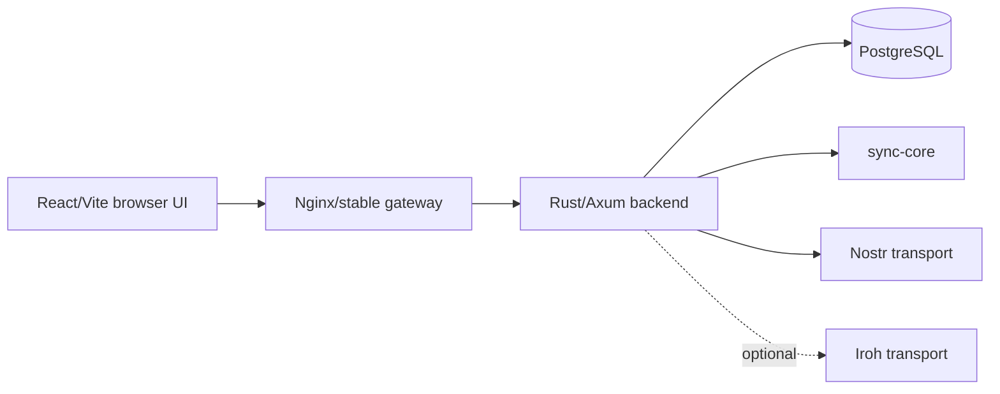

# 01 — Reconstructed current state and dependency map

## Evidence legend
- **[FACT]** directly supported by uploaded source/code or an official platform specification.
- **[INFERENCE]** derived from multiple facts, but not an existing contract.
- **[PROPOSAL]** target desktop architecture decision.
- **[EXPERIMENT-NEEDED]** must be proven by prototype/measurement before promotion.

For major choices the blueprint uses: **decision → grounds → rejected alternatives → costs → failure modes → verification**.

## 1. Actual v2 shape

**[FACT]** The web/backend archive is p2pKanban `2.0.0`. The current user path described by its README requires Python 3.11+ and Docker Desktop/Engine with Compose; Rust, Node and PostgreSQL are not required on the host.

**[FACT]** The actual backend is a normal Rust/Axum process. `backend/src/main.rs` loads settings, creates a `sqlx` PostgreSQL pool, runs embedded migrations, builds `AppState`, spawns transport workers, binds a TCP listener and serves Axum. Docker is therefore packaging/orchestration, not a fundamental business-logic requirement.

**[FACT]** The Rust workspace contains backend plus `sync-core`, `nostr-transport` and `iroh-transport`. Default feature enables Nostr shadow; Iroh is optional.

**[FACT]** PostgreSQL coupling is deep. Migrations/repositories use PostgreSQL-specific features including `jsonb`, `timestamptz`, `gen_random_uuid()`, GIN, `FOR UPDATE SKIP LOCKED`, intervals/functions, `jsonb_to_recordset`, casts and JSONB operators. A SQLite port cannot be a DSN swap or mechanical SQL translation.

## 2. Persisted domain and migration history

**[FACT]** There are 19 PostgreSQL migrations:

1. extensions/helpers
2. identity/access
3. boards/cards/collaboration
4. sync/audit foundation
5. archived cards
6. appearance/customization
7. activity entries
8. sync transport outbox
9. roaming board sync
10. mobile checklists/productivity/wallpapers
11. account workflow/accent
12. roaming echo guard
13. web-node-link identity
14. deletion scope/tombstones
15. roaming checklist delta/history repair
16. column-as-card-status cleanup
17. roaming board appearance
18. workspace invitations/capability epochs
19. device-link/integration evidence

**[FACT]** The effective data model includes users/devices/sessions, workspaces/membership, boards/columns/cards, labels/edges, checklists/items, comments, activity/audit, appearance, replicas/change events/cursors, outboxes, roaming field versions, tombstones, local hides, capability epochs, invitations, device-link grants/challenges and integration evidence.

## 3. Frontend boundary and browser dependencies

**[FACT]** The frontend is React 18.3 + Vite 5.4 + TypeScript 5.5. `frontend/src/shared/api/client.ts` centralizes most feature calls through `apiRequest()`, using `fetch(env.apiBaseUrl + path)`, an in-memory access token, refresh callback and normalized API errors.

**[INFERENCE]** This is a strong seam for a desktop request transport: feature screens can stay mostly unchanged while `apiRequest` delegates to HTTP in web mode or typed IPC in desktop mode.

**[FACT]** Browser-only dependencies are finite: localStorage, Browser Notifications, `navigator.onLine`, clipboard/userAgent, `window/document/matchMedia`, download anchors/Blob URLs, prompt/confirm, and source-update control calls. These require runtime adapters, not an automatic whole-UI rewrite.

**[FACT]** Web local-first persistence currently uses localStorage with `LOCAL_FIRST_SCHEMA_VERSION = 2`; it is not equivalent to a durable desktop database.

## 4. Android as native/local-first reference

**[FACT]** Android is also v2.0.0, built with React Native/Expo. It uses AsyncStorage for local data and Expo SecureStore for sessions/capability secrets/device secret. Native rotating refresh token is persisted securely; access token stays in memory.

**[FACT]** Android local-first snapshot schema is version `6`. It stores a board snapshot plus columns/cards/checklists and a pending queue. Operation states include `pending`, `relay_pending`, and `failed`; operations carry attempts/errors and optional capability epoch.

**[FACT]** Android demonstrates that the product can separate:
- durable local user state,
- secure secret state,
- pending operations,
- encrypted roaming transport,
- node-coordinated structural operations.

**[INFERENCE]** Android is a semantic/conformance reference, not a storage/runtime implementation to transplant. AsyncStorage/SecureStore/Expo lifecycle should not become desktop architecture.

## 5. Authentication

**[FACT]** Backend exposes native auth endpoints:
- `/api/v1/auth/native/sign-up`
- `/api/v1/auth/native/sign-in`
- `/api/v1/auth/native/refresh`
- `/api/v1/auth/native/sign-out`

**[FACT]** Android uses the native flow because cookie auth is unsuitable as its primary native-session mechanism.

**[PROPOSAL]** Desktop must split local identity from remote HTTP session auth. The in-process WebView→Rust command path does **not** mint JWT/cookies to authenticate the app to itself: local access is bound to the opened desktop profile, OS user/session and optional profile unlock. When desktop talks to a legacy web/backend or future coordinator over its native HTTP auth contract, it reuses the Android-style token lifecycle: access token memory-only, rotating refresh token in the OS vault. Web cookies remain a web-only compatibility detail. P2P writes are authorized by board/device capability material and epochs, not by a local UI JWT.

## 6. Sync-core and merge contracts

**[FACT]** Rust `sync-core` defines `SYNC_PROTOCOL_VERSION = "p2p-kanban-sync/1"`. Client events carry event/replica identifiers, replica sequence, entity type/id, operation, field mask, logical clock, base server order, timestamp, payload and metadata. Server events add ordering/actor data. Signed envelopes add workspace, parents and emitted time.

**[FACT]** The Iroh crate uses ALPN `p2p-kanban/sync/1`; it is implemented but not the default production transport in the provided bootstrap.

**[FACT]** Android roaming defines `ROAMING_PROTOCOL_VERSION = "p2p-kanban-roaming/1"`. Capabilities contain workspace/board, board tag/key, capability epoch, write permission/writer keys, relays, event kind and minimum relay ACK count.

**[FACT]** Roaming content is encrypted with XChaCha20-Poly1305. The board tag is derived via HMAC-SHA256 with domain `p2p-kanban:board-tag:v1`. Android's deterministic version comparison is `logicalClock → replicaId → eventId`; field versions and tombstones are part of merge state.

**[FACT]** Relay publication after `minimumRelayAcks` proves relay storage, not coordinator/peer projection. A pending mutation cannot be finalized solely because enough relays acknowledged it.

## 7. Device link, node link and portable data

**[FACT]** Android device-link protocol is `p2p-kanban-device-link/2`, with Nostr kinds:
- 27780 grant
- 27781 request
- 27782 response

It verifies signed events, constrains delegation chains/expiry, encrypts payloads, and chunks large snapshots.

**[FACT]** Web node-link format is `p2p-kanban-web-node-link`, version 1, max response 32 MiB. Destination is expected to be empty. It carries stable user UUID, owned workspaces and planner data, tombstones and board capabilities. It intentionally does **not** carry password hash, active sessions/tokens, device records, deployment JWT secret, global backend master key or deployment Nostr signing secret. Shared workspaces and node-local hides are omitted in v1.

**[FACT]** Portable application bundle format is `p2p_planner_bundle`, `formatVersion = 1`. It is an application-level snapshot, not a PostgreSQL dump and not a complete replica log. Current design avoids silent destructive overwrite of existing data.

**[PROPOSAL]** These logical formats—not raw PostgreSQL storage—must anchor Docker→desktop migration and web↔Android↔desktop coexistence.

## 8. Current update/backup model

**[FACT]** Current Docker update strategy builds side-by-side images, creates PostgreSQL backup, switches backend/web behind a stable gateway, checks readiness/data counts and can revert code images. It does not automatically restore the database dump simply because code rollback occurs. Migration discipline therefore already assumes expand/contract compatibility.

**[FACT]** PostgreSQL backup uses logical dump plus hash/count validation and a separate restore drill. It is deployment disaster recovery, not the portable cross-client data contract.

**[INFERENCE]** Desktop should preserve the useful invariants—immutable release identity, pre-migration backup, health checks, N/N-1 awareness and explicit rollback—while discarding container/image semantics.

## 9. Experimental vs implemented

| Item | Classification |
|---|---|
| React/Vite + Axum + PostgreSQL | **[FACT] current primary architecture** |
| Docker bootstrap/update | **[FACT] current user/deployment path** |
| Web local snapshot/pending ops | **[FACT] implemented, limited browser store** |
| Android local-first snapshot/pending queue | **[FACT] implemented** |
| Nostr roaming/shadow | **[FACT] implemented; product itself remains experimental** |
| `sync-core` | **[FACT] implemented Rust crate** |
| Device-link/2 | **[FACT] implemented Android protocol** |
| Iroh adapter | **[FACT] code exists; [EXPERIMENT-NEEDED] as default transport** |
| Edge coordinator | **[FACT] separate experimental component, not required current runtime** |
| Full coordinator-free P2P | **roadmap/partial, not a proven invariant** |
| Full web/Android feature parity | **not implemented** |
| Generic destructive restore onto arbitrary existing data | **not implemented and should not be inferred** |
| Production-generic webhooks/integrations | **partial/stub/reserved** |

## 10. devctl delivery model

**[FACT]** devctl 0.7.0 applies zip patches through a validated pipeline: choose/inspect patch → validate manifest and safe paths → pre-snapshot → apply deletes/files → run declared checks → commit/push according to workspace policy → post-snapshot/UserTestSpace/report. On partial failure before commit it creates a failed archive and resets the working tree. Workspace Git policy lives in `.devctl/workspace.json`, not in the patch.

**[PROPOSAL]** Desktop work must be delivered as small vertical devctl patch boundaries with executable acceptance checks. Protocol fixtures/repository contracts must land before bulk feature migration.
