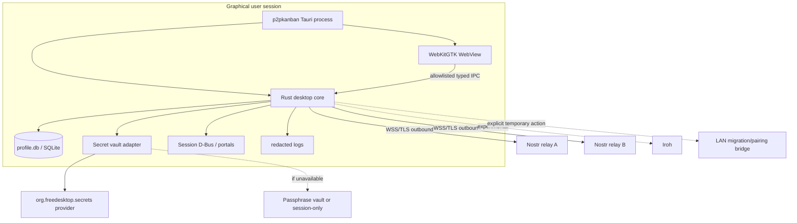
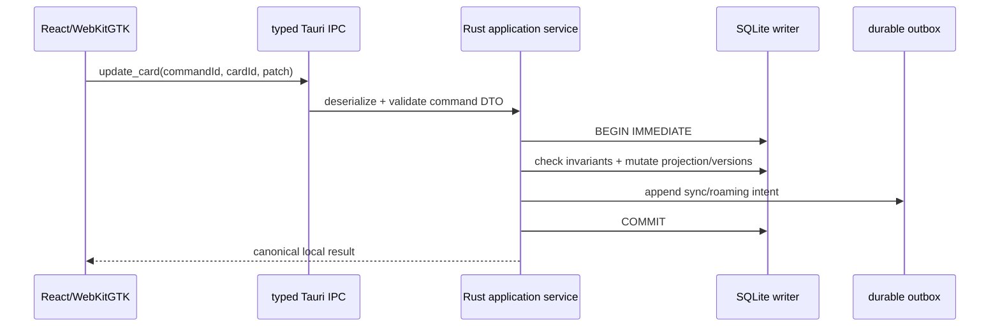
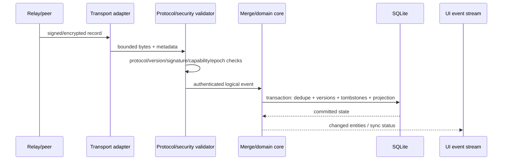
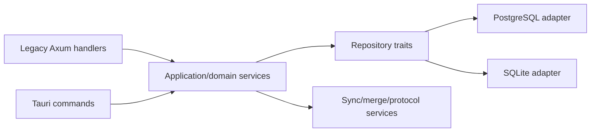
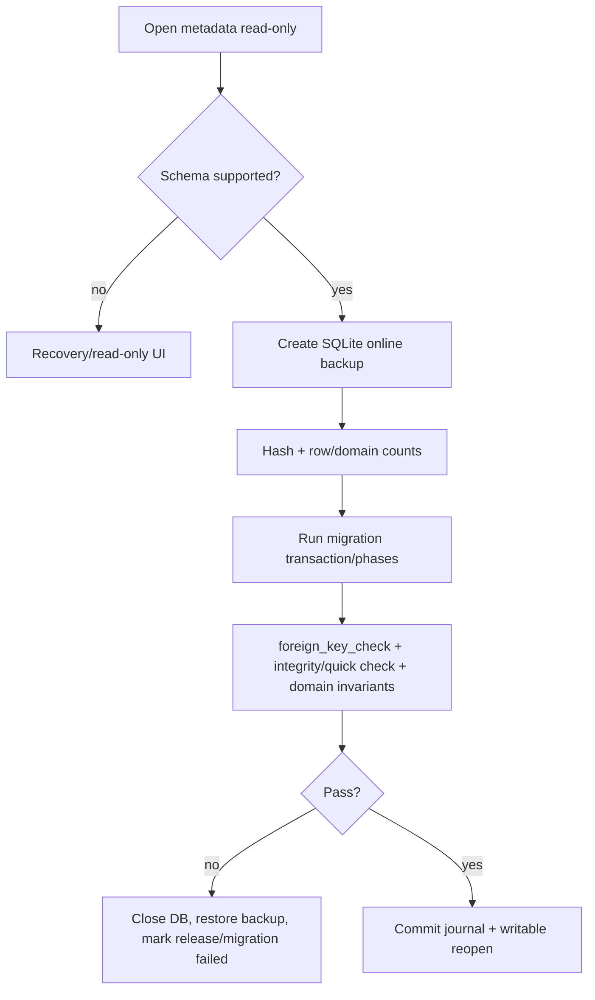

# 03 — Components, process/data flows, storage, sync and trust: Arch Linux

## 1. Process model



**[PROPOSAL]** v1 GA has one normal user-session process and no mandatory systemd unit. Tauri commands call application services in-process. No `localhost` UI server is opened in normal operation.

### Lifecycle rules
- one writable instance per profile; second invocation forwards a validated open/deep-link intent and exits;
- profile lock is advisory/UX first, SQLite locking remains defense-in-depth;
- network, backup and compaction/checkpoint work runs on cancellable async workers;
- closing the last window exits unless the user explicitly enables tray/background mode;
- suspend/session loss correctness relies on durable transactions/outbox, not on receiving a graceful callback;
- D-Bus/portal/keyring disappearance is treated as a recoverable dependency change, not data loss.

## 2. UI → core boundary



The WebView never receives raw SQL, arbitrary filesystem access, shell execution, D-Bus object access, keyring primitives or unrestricted network capabilities. It receives application-shaped commands/events only.

## 3. Remote event flow



Relay ACK remains transport evidence only; it must not be promoted to semantic application of a mutation.

## 4. SQLite storage strategy

### Decision
**[PROPOSAL]** one authoritative SQLite database per profile, with:
- `PRAGMA foreign_keys = ON`;
- `journal_mode = WAL` on supported local filesystems;
- `synchronous = FULL` initially;
- serialized writer actor / explicit transaction boundary;
- bounded busy timeout;
- application-level IDs and deterministic order keys preserved from existing contracts.

**Grounds →** embedded transactional storage removes PostgreSQL/service/runtime overhead while retaining crash consistency required for local-first semantics.

**Rejected alternatives →** bundled PostgreSQL, JSON/AsyncStorage authority, generic SQL dialect shim that hides PG-specific behavior.

**Costs →** schema/query rewrite, migration tooling, repository-contract suite, SQLite-specific operational knowledge.

**Failure modes →** DB placed on unsuitable network/FUSE filesystem, disk full, long reader causing WAL growth, semantic drift from PostgreSQL behavior, old binary opening newer schema.

**Verification →** dual repository contract tests, kill/power tests, integrity checks, WAL soak, supported-filesystem diagnostics, N/N-1 reader/writer gates.

### Proposed XDG layout

```text
$XDG_DATA_HOME/p2pkanban/             # default ~/.local/share/p2pkanban
  profiles/default/
    profile.db
    backups/
    migration-journal.json
  imports/
$XDG_CONFIG_HOME/p2pkanban/           # default ~/.config/p2pkanban
  settings.json
  release-channel.json
$XDG_STATE_HOME/p2pkanban/            # default ~/.local/state/p2pkanban
  logs/
  crash/
  last-run.json
$XDG_CACHE_HOME/p2pkanban/            # default ~/.cache/p2pkanban
  webview-cache/
  downloads/
```

Secret ciphertext may live in the SQLite DB, but the vault root/wrapping material must not be stored beside it in plaintext.

### Filesystem policy
- default DB location must be a local user data directory;
- user-selected profile relocation to NFS/SMB/FUSE/cloud-sync folders is unsupported until explicitly qualified;
- if filesystem capabilities are suspicious, fail to a read-only/recovery explanation rather than silently weakening durability;
- backups may target removable/network storage because they are immutable exported artifacts, not live WAL databases.

## 5. Logical schema groups

Desktop schema should express product semantics rather than copy server migration filenames:
- profile/device/identity metadata;
- workspaces, memberships, invitations, capability epochs;
- boards, columns, cards and ordering;
- labels/edges;
- checklists/items;
- comments and activity/audit provenance;
- appearance and device-local preferences/hides/reminders;
- replica IDs, cursors, seen-event/dedupe state;
- durable pending/outbox state;
- field versions, logical clocks and tombstones;
- roaming metadata and transport state;
- import/link evidence;
- schema/min-reader/min-writer/migration journal metadata.

Refresh tokens, board keys, Nostr/device private keys and vault roots are not plaintext columns.

## 6. Repository extraction boundary



The extraction must happen before bulk SQLite work. A repository interface is accepted only when the same logical scenarios can execute against legacy PostgreSQL and desktop SQLite without leaking `sqlx::Pg*`, PostgreSQL JSON operators or lock syntax into domain code.

**[FACT — A04 implementation]** The native repository now contains a storage-independent `PlannerRepository`/`PlannerTransaction` boundary plus executable reference contract scenarios for card CRUD/order/archive/delete+tombstone, exact access-epoch rejection, scoped reorder and transaction rollback. It intentionally contains no SQL adapter. A05 must execute the same scenario suite against SQLite before this extraction is considered proven for the desktop persistence adapter. The exact position-allocation gap is not a contract because the supplied web and Android implementations differ (1024 vs 1000).

## 6A. Existing component reuse/deprecation map

| Existing component | Arch desktop action | Why / boundary |
|---|---|---|
| React/Vite feature UI | **Reuse first** | mature product surface; native quality comes from shell/XDG/D-Bus/package integration, not a forced widget rewrite |
| `frontend/src/shared/api/client.ts` | **Refactor into transport facade** | web keeps HTTP adapter; Arch desktop uses typed Tauri IPC |
| browser local-first `localBoardStore` / localStorage | **Do not keep as authority** | semantic reference only; durable authority moves to Rust+SQLite |
| browser notifications/download/localStorage helpers | **Replace with Linux adapters** | D-Bus notifications, portal/native file dialogs, XDG state |
| backend Axum handlers/router/middleware | **Web-only compatibility layer** | normal desktop has no local HTTP service |
| backend `service.rs` logic | **Extract/reuse selectively** | retain use-case validation after removing HTTP/PG dependencies |
| backend `repo.rs` SQL | **Legacy PostgreSQL adapter/evidence** | PG-specific queries are not portable; implement SQLite repository separately |
| auth token/device-link/pairing semantics/crypto | **Reuse protocol/domain logic** | desktop creates fresh device/session; secrets use Secret Service/passphrase vault |
| `backend/crates/sync-core` | **Direct shared Rust core candidate** | protocol-oriented and naturally reusable |
| `nostr-transport` | **Reuse with Linux lifecycle adapter** | current implemented transport; integrate suspend/network/backoff without daemon assumption |
| `iroh-transport` | **Feature-gated experiment** | not required for GA until Arch/NAT/VPN field evidence exists |
| backend roaming/transport worker logic | **Refactor behind repository/lifecycle traits** | keep queue/protocol semantics, remove PG/process assumptions |
| `edge-coordinator` | **Optional external compatibility/experiment** | not an installed daemon and not required for offline/local correctness |
| Docker/bootstrap/release scripts | **Do not ship** | keep backup/health/rollback lessons, discard container/image runtime |
| Android local-first snapshot/pending model | **Semantic reference + fixture source** | do not transplant AsyncStorage/Expo lifecycle |
| Android roaming merge/codec | **Conformance oracle for Rust core** | share canonical vectors; avoid divergent TS/Rust merge definitions |
| Android device-link/2 | **Compatible Rust participant** | preserve wire/signature/delegation behavior, not mobile implementation |
| devctl | **Development/release conveyor only** | patch/check/snapshot evidence; not installed with user app |

**Shared-core gate:** only domain/protocol/crypto/repository abstractions that remain genuinely OS-neutral belong in common Rust crates. XDG paths, Secret Service, D-Bus/portals, pacman/AppImage and systemd/session behavior stay Arch/Linux adapters rather than being hidden behind lowest-common-denominator Windows abstractions.

## 7. Desktop schema and migration line

**[PROPOSAL]** Desktop owns an independent monotonically versioned schema. Server migrations `0001..0019` are evidence for semantics, not executable SQLite migrations.

Persist at minimum:
- `schema_version`;
- `min_reader_app`;
- `min_writer_app`;
- migration ID/checksum/source version;
- migration start/completion status;
- last verified backup hash.



A release that makes irreversible schema changes cannot advertise automatic binary downgrade unless it also owns a proven reverse migration or restores a matching pre-migration snapshot.

## 8. Secret model on Linux

### Primary provider
Use a small vault root key stored/wrapped through the freedesktop Secret Service API when an unlocked provider is available in the user session. Store only bounded, typed secrets under stable attributes; application data remains in SQLite.

### Fallback provider
If no usable Secret Service exists:
1. offer an explicit local passphrase vault;
2. derive a KEK with Argon2id using stored salt/parameters;
3. authenticate-encrypt a random vault root (e.g. XChaCha20-Poly1305, already aligned with roaming crypto primitives);
4. keep decrypted root only in memory;
5. alternatively allow session-only credentials for users unwilling to set a passphrase.

**Never:** silently store refresh tokens/board keys/private keys in JSON, SQLite plaintext, environment files or WebView localStorage.

### Failure semantics
- provider locked → show unlock/retry/session-only path;
- provider absent → passphrase/session-only choice;
- provider removed after setup → fail closed for secrets, local non-secret planner data remains readable;
- lost passphrase/provider key → recover through re-auth/device-link/portable encrypted export where possible, not through insecure bypass.

### At-rest claim boundary
v1 protects **secret material**, not all card content. Full planner-content encryption is a separate product/security decision (SQLCipher/page encryption/filesystem encryption trade-offs) and must not be implied by the vault design.

## 9. Auth/session/identity behavior

Keep three independent concerns:
1. **Local profile principal:** stable user UUID plus a fresh Arch device/replica identity. Tauri UI→core IPC is local/in-process and does not authenticate with JWT/cookies. An optional profile/app lock is independent from the legacy web account password.
2. **Remote HTTP session:** only for a legacy web/backend or future coordinator API that requires native auth. Access token remains memory-only and rotating refresh token remains Secret-Service/passphrase-vault protected. Remote refresh failure never blocks already-present local data edits.
3. **P2P capability authority:** board/device keys, signed writer identity and capability epoch govern roaming writes/acceptance. HTTP session state does not replace capability checks.

Remote sign-out removes the corresponding remote session secret but does not erase local planner data or local replica identity. Re-authentication must not rewrite stable entity IDs.

## 10. Sync/P2P lifecycle

### Nostr/roaming first
1. open local profile and pending queue;
2. unlock required board/device keys lazily;
3. connect outbound to configured relay set with jittered backoff;
4. backfill from persisted cursor/seen-event state;
5. verify signature/delegation/protocol/board tag/capability epoch;
6. decrypt `p2p-kanban-roaming/1` payload;
7. apply deterministic field-version/tombstone merge;
8. publish durable local outbox;
9. record relay acknowledgements without treating them as final application state;
10. on resume/network change, reconnect and reconcile idempotently.

### Rust `sync-core`
**[PROPOSAL]** preserve `p2p-kanban-sync/1` and reuse the Rust crate where it represents protocol/domain semantics. Create canonical JSON/golden vectors consumed by backend, desktop and mirrored Android tests.

### Iroh
**[EXPERIMENT-NEEDED]** keep behind a feature gate until Arch-specific measurements prove useful behavior across home NAT, VPN, restrictive ISP, suspend/resume and relay fallback. Local startup/editing must never depend on it.

### Edge coordinator
Treat current edge coordinator as an optional/experimental compatibility component. Desktop must not require a separately installed coordinator daemon for GA.

## 11. Optional LAN migration/pairing bridge

Only for workflows that cannot yet be expressed through device-link/2 or portable bundle:
- explicit user action starts it;
- bind selected interface or clearly disclosed LAN address, random high port;
- random one-time capability / QR payload;
- short TTL and auto-close after completion;
- strict endpoint/size/rate allowlist;
- no cookies; no generic browser session auth;
- no shell/update/arbitrary file API;
- no automatic nftables/firewalld/polkit mutation;
- visible indicator and manual stop control.

Long-term goal is to remove this bridge once device-link/native transports cover migration/pairing.

## 12. Trust-boundary matrix

| Boundary | Threat/failure | Required control |
|---|---|---|
| WebKitGTK renderer → Rust core | XSS/compromised UI content | CSP, local packaged assets, no remote navigation, typed allowlisted IPC, strict DTO validation |
| Relay → core | replay/drop/reorder/metadata observation | signatures, AEAD, event IDs, dedupe, capability epoch, deterministic merge |
| LAN bridge | hostile Wi-Fi/LAN | off by default, one-time auth, TTL, limits, narrow API, explicit UI |
| Secret Service → app | locked/absent/malicious session provider | fail closed, provider identity not treated as remote trust root, passphrase/session-only fallback |
| imported bundle/node | malformed/oversized/incompatible data | version/size/count/reference validation, staging DB/transaction, backup before commit |
| package/repository | compromised mirror | package/repo signatures, checksums, pinned release metadata; mirrors are distribution only |
| same-user malware | process/keyring access | outside local vault guarantee; minimize secret lifetime/logging and IPC exposure |

## 13. Concurrency/conflict invariants
- UUID identity must remain globally stable across stores;
- one local writer actor avoids accidental write races but does not replace protocol conflict handling;
- merge order remains the defined logical comparator, not local wall-clock ordering;
- tombstones carry enough ordering/version context to prevent stale resurrection;
- capability epoch changes invalidate obsolete write authority without deleting already valid local history;
- imports/link operations are staged and atomic; empty-profile requirement is preserved where existing web-node-link v1 requires it;
- schema negotiation and protocol negotiation are separate: a new local schema version must not silently imply a new wire version.
