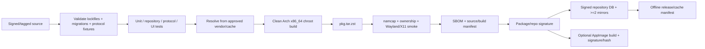
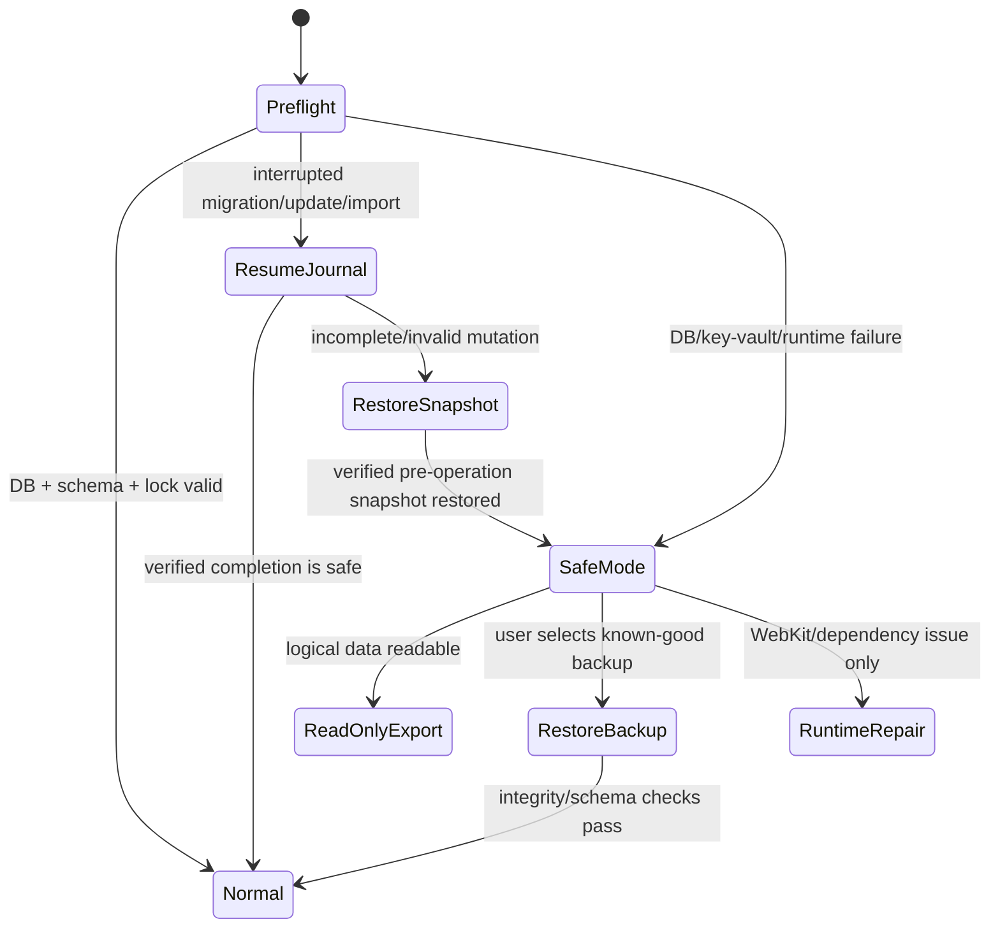

# 05 — Release, supply chain, diagnostics, recovery, performance and risks: Arch Linux

## Evidence legend

`[FACT]` = observed in uploaded sources or official platform/specification documentation.  
`[INFERENCE]` = conclusion from facts that still needs implementation validation.  
`[PROPOSAL]` = target design.  
`[EXPERIMENT-NEEDED]` = must be proved before GA.

## 1. Release and dependency-supply-chain model

### Decision A-REL-001 — runtime works without registries/CDNs

**Decision — [PROPOSAL].** Once the application and its declared Arch runtime dependencies are installed, normal local operation must not require Docker Hub, GHCR, npm, crates.io, GitHub Releases, a vendor CDN or the project package repository to be reachable.

The user must be able to launch, browse/edit local boards, queue sync operations, export data, inspect diagnostics and restore a local backup completely offline. Networking is needed only for capabilities that are inherently remote: relay/P2P sync, remote auth refresh when required, device linking to another device, and optional update discovery.

**Grounds.**
- [FACT] Current browser deployment uses Docker/Compose for delivery, while the backend is itself an ordinary Rust process and the frontend is static-buildable React/Vite.
- [FACT] Android already proves durable local state + pending operations can survive disconnected operation.
- [INFERENCE] A desktop release that downloads runtimes or application code at first launch would preserve the same infrastructure fragility this project is trying to remove.

**Rejected alternatives.**
- first-launch `cargo/npm` install;
- pulling backend/container images on demand;
- installing a private WebKit runtime from an application-controlled CDN;
- disabling TLS/signature checks when a preferred origin is unavailable.

**Costs.** Release repository, mirrors, cache retention, SBOM/signing and offline-rebuild discipline.

**Failure modes.** Stale mirror, expired package-signing key, Arch dependency transition, unavailable preferred relay, corrupt offline cache.

**Verification.** Build an offline test VM from a previously captured complete package set; launch and execute the entire local workflow with all project distribution origins blocked.

## 2. Build-time dependency policy

**[PROPOSAL]** Release construction uses pinned/reviewable inputs:
- Rust toolchain pinned with `rust-toolchain.toml`; committed `Cargo.lock`;
- `cargo vendor` or a content-addressed internal mirror/cache sufficient for offline rebuild;
- committed `package-lock.json`; `npm ci` from a verified cache/mirror during controlled release builds;
- exact Tauri CLI/plugins locked;
- PKGBUILD references an immutable source archive/commit and cryptographic checksums;
- Arch package build occurs in a clean chroot/container-like *build environment* owned by CI/devtools, never becoming a runtime dependency;
- release captures package database snapshot/build-environment manifest for reproducibility diagnosis;
- SBOM/license inventory covers Rust crates, npm dependencies, native libraries linked/bundled, packaged assets and AppImage payload when produced;
- source tarball + lockfiles + vendored/cache manifests retained with every release.

No release path may rely on floating `latest`, `curl | sh`, disabled TLS verification, ignored PGP/checksum errors or ad-hoc binaries downloaded during `package()`.

## 3. Proposed release pipeline

A release is not “reproducible” merely because the same source commit builds twice on one workstation. Release evidence should retain source commit, toolchain version, Arch package list, PKGBUILD, lockfiles, migration digest, protocol fixture digest and artifact hashes.

## 4. Package/repository authenticity

### pacman channel
Trust roots are package/repository signing keys and local pacman trust configuration. Mirrors are transport/distribution origins, not independent trust anchors.

**[PROPOSAL]** Release metadata records:
- app version/build ID;
- source commit/tag;
- package filename, architecture, size and SHA-256;
- package signature key ID;
- supported desktop DB reader/writer schema range;
- migration-set digest;
- protocol versions supported;
- minimum known runtime dependency set;
- publication sequence/time;
- known-bad/withdrawn builds.

The application may query a signed lightweight “latest-version” document for UX, but it must never run `sudo pacman`, rewrite `/usr`, import trust keys silently or turn a notification into an automatic partial upgrade.

### AppImage channel
If shipped, verify a signed release manifest + full artifact hash before any self-managed replacement. AppImage update trust is independent from pacman and must not reuse package-manager state implicitly.

## 5. Russian/offline network resilience

### Build time
Maintain at least two retrievable/mirrorable origins for project release artifacts where practical. Keep offline/exportable caches for crates/npm/toolchain/source dependencies used to build supported releases. Prefer source-vendoring and content-addressed cache export over proprietary “registry is always online” assumptions.

### Runtime
- relay list is configurable and supports multiple endpoints;
- no single project relay is a startup dependency;
- failed update check is non-fatal and quiet after bounded retry;
- blocked GitHub/Docker/npm/crates endpoints do not affect installed local functionality;
- recovery instructions never recommend certificate bypass, insecure HTTP substitution or disabling package signature verification.

## 6. Diagnostics and observability

### Structured logs
Store bounded, rotated logs under `$XDG_STATE_HOME/p2pkanban/logs` (fallback per XDG defaults). Do not require systemd journal access.

Redact by default:
- access/refresh tokens;
- passwords/passphrases;
- board/Nostr/device private keys;
- Secret Service item secret values;
- device-link grant/request payloads;
- full card/comment bodies;
- imported bundle content;
- URLs/query strings that can embed capabilities.

Useful fields may include:
- build ID/version;
- component;
- local profile UUID (non-secret);
- schema/migration version;
- replica/event ID;
- transport and retry class;
- WebKitGTK version;
- Wayland/X11/session/desktop family;
- keyring provider status (`available|locked|absent`, no secret metadata);
- queue counts/durations/error class.

### Diagnostic bundle
User-generated support bundle includes:
- sanitized logs;
- app/source/build IDs;
- OS/kernel/architecture;
- package version and direct dependency versions;
- WebKitGTK/Tauri runtime diagnostics;
- session type and desktop environment;
- DB schema/migration journal and integrity result;
- pending queue counts, not payloads;
- provider capability status (notifications/tray/Secret Service/portal);
- configuration feature flags with secrets stripped.

It excludes planner content and secrets unless the user explicitly creates a separately encrypted data export.

## 7. Crash/recovery state machine

A WebKitGTK/runtime failure must not be misdiagnosed as database corruption. Core recovery tooling should remain callable from CLI/native preflight where practical even if the WebView cannot start.

## 8. Backup classes

| Backup/artifact | Purpose | Cross-machine? | Secret handling | Stability |
|---|---|---:|---|---|
| Internal SQLite snapshot | crash/update/migration rollback | not guaranteed | encrypted secret rows; vault root external | private implementation |
| `p2p_planner_bundle` v1/successor | user interoperability | yes | no deployment/session secret | public application contract |
| device-link/2 transfer | provision identity/capability | yes, authenticated | protocol-wrapped capabilities | public protocol |
| web-node-link v1 | legacy node migration | yes to empty destination | intentionally excludes deployment/session secrets | public migration contract |
| PostgreSQL dump | legacy deployment DR | not direct desktop import | can contain sensitive DB state | legacy operator artifact |

**[PROPOSAL]** Internal live backups use SQLite Online Backup API or an equivalently safe connection-level snapshot; never `cp profile.db` while WAL may hold committed state. Each backup has a manifest containing app/schema version, timestamp, hash, selected row/domain counts and integrity-check result.

Retention keeps at least one verified last-good pre-update/pre-migration point until a newer restore point has itself been verified.

## 9. Safe mode

Safe mode is deliberately low-capability:
- profile opened read-only when possible;
- no relay/Iroh/LAN connections;
- no automatic update activity;
- no migrations unless user selects a recovery action;
- secret unlock is optional unless needed for a chosen export;
- integrity checks, restore-point listing and logical export available;
- exact failing migration/import/package/runtime diagnostic shown.

For WebKitGTK startup failure, provide a minimal CLI/native diagnostic command such as `p2pkanban doctor` so recovery does not depend on the broken renderer.

## 10. Performance and power budgets

Values are **[PROPOSAL] budgets**, not claims about current source.

Because WebKitGTK may use multiple helper processes, measure the aggregate application process tree (prefer PSS/USS where available), not only the Tauri parent RSS.

| Metric | Target | Review/fail gate | Measurement |
|---|---:|---:|---|
| Warm UI usable | <= 1.0 s p95 | > 1.5 s requires investigation | current Arch laptop |
| Cold UI usable | <= 2.5 s p95 | > 3.5 s | reboot/cold-cache sample |
| Idle aggregate PSS | <= 110 MiB | > 160 MiB requires ADR | 10 min settled, WebKit children included |
| Idle CPU | < 0.5% average | >= 1% | `pidstat`/perf, aggregate tree |
| Idle disk writes | near zero | periodic writes without pending work | `iotop`/bpf/perf trace |
| Background wakeups | event/timer bounded | sub-minute polling when idle | power/top/timer trace |
| Local mutation ack | <= 50 ms p95 | > 100 ms | 10k-card fixture |
| Resume to usable local UI | <= 2 s p95 | > 5 s | suspend/resume loop |
| Reconnect stabilization | <= 10 s typical after network returns | unbounded/busy reconnect | relay harness + real networks |

Power policy:
- no default daemon/service;
- no busy connectivity polling;
- reconnect uses exponential backoff + jitter;
- batch/coalesce pending flush and checkpoints;
- tray/background mode is explicit;
- stop non-essential timers while suspended/session inactive;
- do not wake the laptop just to poll update/relay state;
- defer heavyweight backup/vacuum maintenance when battery/interactive latency makes it harmful.

**[EXPERIMENT-NEEDED]** Compare current browser+Docker path, Tauri+system WebKitGTK and (only as a control) Electron on the same 8–16 GiB laptop using aggregate memory, CPU, wakeups, disk I/O, startup and temperature/power proxies.

## 11. Threat and failure-mode matrix

| Threat/failure | Asset/boundary | Consequence | Primary mitigation | Verification |
|---|---|---|---|---|
| XSS/compromised packaged UI | WebView→Rust IPC | privileged command invocation | local assets, CSP, navigation allowlist, typed IPC, no raw shell/fs/db | hostile DOM/navigation corpus, command fuzz |
| remote navigation opened inside app | WebView | origin gains app bridge context | block/hand off external URLs to system browser; verify origin per command | E2E external-link tests |
| malicious relay event | sync core | state corruption/replay | signature/AEAD/version/capability/epoch/dedupe checks | replay/reorder/fuzz vectors |
| missing/locked Secret Service | secrets | auth unavailable | passphrase/session-only fallback, fail closed | GNOME/KDE/minimal WM matrix |
| hostile same-user D-Bus peer | local IPC metadata | spoofed desktop service/status | never treat notification/tray provider as security authority; validate own IPC | mocked D-Bus services |
| malicious import/bundle | local DB | corruption/resource exhaustion | size/count/schema/reference validation, staging transaction, backup | parser fuzz + bomb corpus |
| stale/compromised mirror | package | malicious/old binary | signature + hash + monotonic release metadata | mirror tamper/replay test |
| signing key compromise | release chain | malicious signed release | offline/restricted key handling, key rotation/revocation procedure | incident drill |
| Arch partial upgrade | native runtime | ABI/app breakage | explicitly unsupported; doctor detects package mismatch; never induce it | broken-state diagnostic test |
| WebKitGTK regression | renderer | blank/crashing UI | package/version diagnostics, rolling test matrix, CLI recovery | pre-release current Arch + canary |
| soname/dependency transition | startup | loader failure | clean rebuild/current repo testing, package dependencies | dependency transition rehearsal |
| Wayland/X11 behavioral difference | UI/lifecycle | clipboard/tray/focus bugs | dual-session E2E | KDE/GNOME Wayland + X11 |
| no tray host | lifecycle UX | hidden process/user confusion | capability detection, explicit close behavior | GNOME/no-extension test |
| DB on NFS/FUSE/cloud-sync | persistence | WAL/locking/corruption risk | local-default + unsupported-location warning/block | filesystem matrix |
| disk full/read-only home | DB/backups | failed commits/migrations | transactional writes, reserve/error handling, no delete-before-new-backup | fault injection |
| suspend during write | local state | partial operation | DB transaction/WAL; durable outbox | repeated suspend/kill tests |
| network switch/VPN/DNS loss | transport | stale connection/duplicate retry | idempotency, backoff, reconnect/cursor | chaos network suite |
| temporary LAN bridge exposed | LAN | unauthorized access | explicit TTL/one-time auth/allowlist/no firewall auto-edit | hostile LAN test |
| old binary against new schema | DB | corruption/misread | min reader/writer gates; read-only recovery | downgrade tests |
| package downgrade without DB restore | DB/app | incompatibility | distinguish package rollback and data rollback | documented rollback drill |
| AppImage from untrusted source | binary | code execution | signed manifest/hash, documented publisher keys | tamper test |
| lost passphrase/provider key | vault | secret loss | re-auth/device-link/recovery export; never insecure bypass | recovery drill |
| same-user malware | vault/process | secret theft | out of at-rest threat guarantee; minimize lifetime/surface | threat-model assertion + secret scans |

## 12. Failure-containment priorities

1. **Never lose or silently rewrite acknowledged local edits.** Transport failure is tolerated; durability failure is release-blocking.
2. **Fail closed on secrets and authorization.** Missing keyring is not permission to downgrade secrecy.
3. **Keep package/runtime breakage separate from data health.** A WebKit/ABI issue must not trigger destructive profile repair.
4. **Keep local-first usable when all remote infrastructure is gone.**
5. **Prefer explicit unsupported state over clever bypass.** Partial Arch upgrades, live DB on hostile filesystems and unsigned update artifacts are diagnosed, not “fixed” by weakening invariants.
6. **Recovery must be testable without Docker.** Normal backup/restore/safe mode belongs to the desktop product itself.
